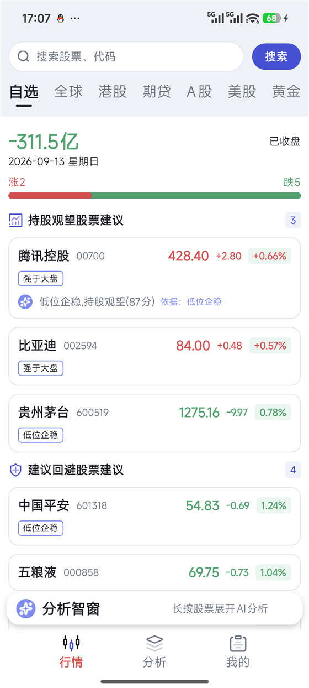
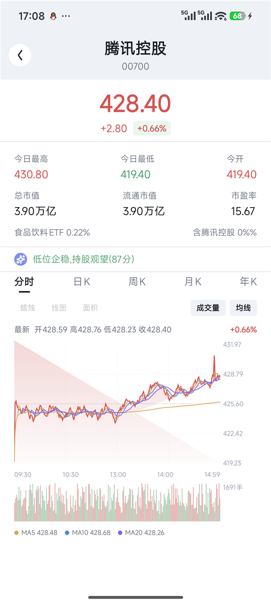
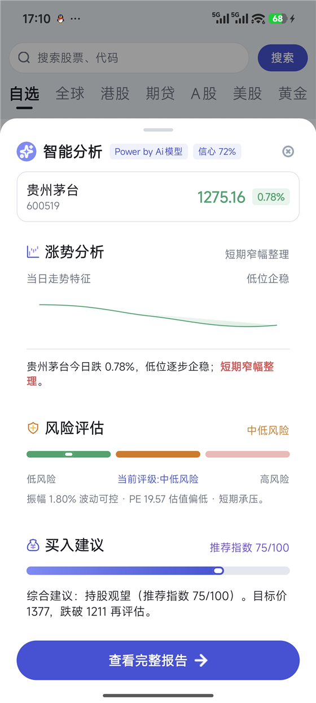
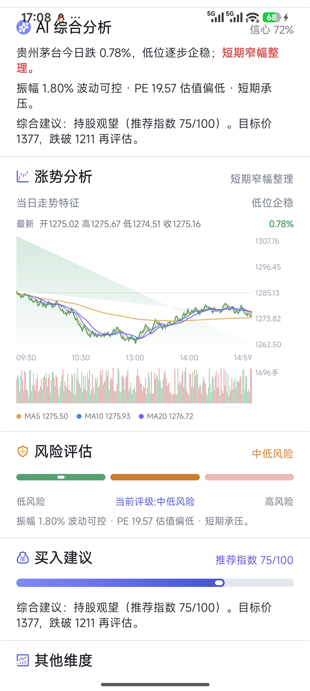

# Kuikly 智能股票行情 App

> **OpenSourceTalent 课题作业 · Task 1**
> 基于 **Kuikly**（Kotlin Multiplatform 跨端框架）+ **Kuikly Compose DSL** 的股票行情应用。
> 一套 Kotlin 代码实现自选行情、个股详情、走势图表与 AI 智能分析；行情来自腾讯，
> **AI 分析由自研 Ktor 后端统一产出，客户端只搬算好的字段**。

---

## 一、界面预览

| 自选行情 | 股票详情 | AI 智能分析 | 完整分析报告 |
|:---:|:---:|:---:|:---:|
|  |  |  |  |
| 大盘摘要 + 按维度分组的自选列表 | 周期 × 样式 × 指标可切的标准图表组件 | 长按股票呼出的分析智窗 | 三段叙事 + 因子明细 + 推理链 |

---

## 二、这是什么

一个**行情 + AI 研判**的自选股应用。核心不是「把数据画出来」，而是解决三件真问题：

> 规模：客户端业务代码 56 个 Kotlin 文件 / ~7.3k 行（全部在 `shared/commonMain`），
> 后端 27 个文件 / ~2.2k 行，含 91 个单元测试。

1. **主路径客户端零解析**——腾讯行情接口返回的是 `~` 分隔的 GBK 文本，字段散落在 40+ 个下标里
   （且 A 股与港股市盈率还在不同下标）。这些脏活收在自研后端，App 只搬已经算好的字段；
   客户端仅在「后端不可用、退回直连腾讯」这一级降级里保留一份等价解析。
2. **数据源可降级**——自研后端 → 直连腾讯 → 本地样例，三级链路任意一级挂掉，页面都还能用，
   并且**明确告诉用户当前看到的是实时、缓存还是样例**。
3. **AI 结论可解释**——不是甩一句「建议买入」，而是给出「评分 / 依据信号 / 因子明细 / 风险等级 /
   目标价与止损价」，并且**同一份推导在后端和客户端各有一份镜像实现**，后端不可用时结论不会变形。

---

## 三、功能清单

### 行情
- **自选列表**：按分组维度（操作建议 / 涨跌 / 市值…）聚合，组头显示计数与维度说明。
- **大盘摘要**：合计市值变动（**Σ 流通市值变动**口径，不是资金净流入）、涨跌家数与红绿涨跌条
  （红条宽度走 `animateFloatAsState` 补间）。
- **下拉刷新**：接通真实拉取，刷新后摘要与列表同源更新。
- **三态可见**：实时 / 非实时（带更新时间，可点重试）/ 示例数据，横幅明示，不糊弄用户。
- **加载与空态**、**列表到底提示**、**逐项错峰入场动画**（`AppearIn`）。

### 详情与图表
- **标准图表组件 `StockChart`**：`components/core/` 下的可复用组件，三个维度独立可配——
  - 周期：分时 / 日K / 周K / 月K / 年K
  - 样式：蜡烛 / 线图 / 面积
  - 指标：均线（MA5/10/20）/ 成交量子图
- 长按拖动出十字线跟随、松手隐藏；点击选点；选中时上方显示该点的时间 / 开高低收 / 涨跌幅 / 成交量。
- 分时图带昨收基准线与均价线；`ChartApi` 接口预留后端接入点。

### AI 能力
- **分析智窗（`AiBottomSheet`）**：长按任意股票呼出，**本地先出、后端校正**——抽屉秒开（离线也能用），
  后台再向后端要更权威的结论，900ms~2500ms 内揭晓；数值相同则不替换、不闪烁。
- **完整分析报告页**：8 段逐段舒展，含涨势分析、风险评估仪表、买入建议进度条、因子明细、
  可折叠的 AI 推理链、相关资讯。
- **分类分组维度**：AI 给出的操作建议可直接作为分组维度，把「分析」变成「能用的组织方式」。

### 工程
- **重组优化**：动画中间值不下沉到列表项子树，避免展开态每帧重组（见 `docs/recomp-analysis-*.md`）。
- **返回键治理**：抽屉/弹层优先消费返回键，先关抽屉再退页面。

---

## 四、架构

```
┌──────────────────────────── 客户端（Kuikly / Kotlin Multiplatform） ────────────────────────────┐
│  shared/  ← 100% 业务代码都在这（commonMain），各端只是薄 host                                    │
│                                                                                                 │
│   pages/         WatchlistPage · StockDetailPage · AiReportPage                                 │
│   components/    StockCard · AiBottomSheet · StockChart · DimensionPickerSheet …                │
│   components/core/  跨页面复用的原语：ExpandableReveal · AppearIn · StateBox · StockChart …       │
│   data/          StockApi · TencentStockApi · StockApis(降级链) · ChartApi · FactorDeriver …      │
│   theme/         AppColors · AppTypography · AppShapes                                          │
└────────────────────────────────────────────┬────────────────────────────────────────────────────┘
                                             │ HTTP(JSON)
┌────────────────────────────────────────────▼────────────────────────────────────────────────────┐
│  backend/  自研后端（Kotlin + Ktor）— 解析 + 推导，独立 Gradle 工程                              │
│   /watchlist            批量行情 → 契约 DTO（含 AI 画像）                                        │
│   /analysis/{token}     单只标的完整分析                                                         │
│   /chart/{token}        前复权 K 线 / 分时                                                       │
│   /health                                                                                       │
│                                                                                                 │
│   QuoteParser(字段下标/单位换算/GBK) · AiEngine(规则引擎 ⟷ LLM 可插拔) · Routes                  │
└────────────────────────────────────────────┬────────────────────────────────────────────────────┘
                                             │
                                    腾讯行情 / K 线接口
```

### 数据源降级链

任何一次取数都走同一条链，**前一级失败自动落到下一级，并如实标注来源**：

| 级别 | 来源 | UI 表现 |
|---|---|---|
| 1 | 自研后端 `/watchlist` `/analysis` `/chart` | 实时（无横幅） |
| 2 | 直连腾讯 `qt.gtimg.cn` | 实时（无横幅） |
| 3 | 本地样例数据 | 「实时行情暂不可用，展示示例数据（点此重试）」 |

另有**缓存态**：已有数据时刷新失败，保留旧数据并把来源标成 `CACHE`，横幅显示
「行情非实时（更新于 HH:mm:ss），点此重试」。

### 单位与字段口径（踩过的坑）

腾讯 `~` 协议里 `change(21)/changePct(22)/high(23)/low(24)` 是**买盘档位**、不是行情，
真正的涨跌在 `32/33`、高低在 `34/35`；市盈率 A 股在 39、港股在 40。
单位口径统一为「价格存分（元 ×100）、市值存元（亿 ×1e8）」：后端在解析时换一次，
客户端的降级直连路径遵循同一口径，两端数值可直接对比。

---

## 五、AI 是怎么做的

**一句话：规则引擎是骨架，LLM 是可选插件。**

- **四维画像**：输出 `action`（操作建议）/ `signal`（依据信号）/ `score`（0–100）/ `scenario`（场景）。
- **评分**：`50 基准 + 动量分(0–60) + 价值分(0–25) + 风险分(0–8)`，收敛到 0–100；
  ≥80 标记为「值得重点关注」，≥85 / ≥70 再分「高分推荐」「中分观察」两档。
- **三段叙事**：涨势分析 / 风险评估 / 买入建议，各自带目标价（现价 +8%）与止损价（现价 −5%）。
- **因子明细**：动量分 / 价值分 / 风险分（**各自标出量程**——三因子不是同一把尺子，只写裸分数会被误读）、
  行业（含组内排名）、相对大盘强弱，逐项摊开，结论可追溯。
- **LLM 缝**：`AiAnalysisProvider` 接口 + `RuleEngineAiProvider` / `LlmAiProvider` 两种实现。
  后端 `AI_PROVIDER=llm` 且配好 `LLM_*` 就走真实大模型；**配置不全自动回落规则引擎，不会 500**。
- **双端镜像**：客户端保有一份等价的推导实现（`deriveAiProfile` / `deriveAiAnalysis`），
  仅用于「本地先出」和离线兜底，且阈值常量与后端逐字对齐（`AiThresh` / `AiLabels`）。

---

## 六、快速开始

### 环境要求

| 项目 | 版本 |
|---|---|
| JDK | **17**（AGP 8.x / Kotlin 2.1.x 要求；Gradle 会取 `JAVA_HOME` 或 PATH 上的 java） |
| Gradle | 8.7（用仓库自带 wrapper，无需本机安装） |
| Kotlin | 2.1.21 |
| Kuikly | 2.7.0-2.1.21 |
| Android SDK | compileSdk 34 / minSdk 23（`androidApp`）、minSdk 21（`shared`）/ targetSdk 30 |

> ⚠️ 仓库里的 `gradle.properties` **没有**写死 `org.gradle.java.home`。
> 若你的机器上默认 java 不是 17，请设置 `JAVA_HOME`，或临时覆盖：
> `./gradlew :shared:compileDebugKotlinAndroid -Dorg.gradle.java.home=/path/to/jdk-17`

### Android（已验证可跑）

```bash
# 只编译业务库（最快的回归门禁）
./gradlew :shared:compileDebugKotlinAndroid

# 装到设备
./gradlew :androidApp:installDebug
# 若厂商 ROM 拒绝 installDebug，改用：
./gradlew :androidApp:assembleDebug
adb install -r -t androidApp/build/outputs/apk/debug/androidApp-debug.apk
```

直连腾讯即可看到真实行情；想走自研后端再启动下一节的服务，并把端口透传给设备：
`adb reverse tcp:8080 tcp:8080`。

### 后端（可选，但推荐）

```bash
cd backend
./gradlew run                  # 默认 8080，需要 JDK 17
./gradlew test                 # 91 个用例，覆盖行情/图表解析、AI 推导、路由契约、配置与 DTO
docker build -t task1-backend . && docker run -p 8080:8080 task1-backend
```

配置项（`PORT` / `TENCENT_*` / `AI_PROVIDER` / `LLM_*`）见 [`backend/README.md`](backend/README.md)。

### iOS / 鸿蒙

两端 host 代码已就绪，但**尚未在对应环境验证**：

- **iOS**：需 macOS + Xcode + CocoaPods，`cd iosApp && pod install`。Kotlin/Native 的 `iosArm64`
  只能在 macOS 上构建。
- **鸿蒙**：独立 Gradle 世界（`settings.ohos.gradle.kts`），需 DevEco 与签名配置。

---

## 七、目录结构

```
Task1/
├── shared/                       # 业务库（唯一真相源）
│   └── src/commonMain/
│       ├── kotlin/com/example/task1/
│       │   ├── pages/            页面：自选 / 详情 / AI 报告
│       │   ├── components/       复用组件（含 core/ 原语层）
│       │   ├── data/             数据源、降级链、因子与 AI 推导
│       │   ├── theme/            颜色 / 字体 / 形状 token
│       │   └── base/             跨端桥接、工具
│       └── assets/               图标与页面资产
├── androidApp/                   # Android host（已跑通）
├── iosApp/                       # iOS host（SwiftUI + CocoaPods）
├── ohosApp/                      # 鸿蒙 host（ArkTS）
├── backend/                      # 自研后端（Kotlin + Ktor），独立 Gradle 工程
├── static_server/                # 本地静态/代理服务（Koa，入口 static_server/serve/index.js）
├── docs/                         # 运行手册、设计规范、实现计划、重组分析
└── rules/                        # Kuikly Compose / DSL 编码规范
```

---

## 八、Kuikly 实践沉淀

这部分是开发过程中**实测**出来的框架行为，已写成注释沉淀在对应代码里，供后来者少踩坑：

| 现象 | 结论 |
|---|---|
| `AnimatedVisibility` / `expandVertically` | 过渡**不逐帧执行**，整段收放会塌成一帧跳变 → 改用 `ExpandableReveal` + 单路 `animateFloatAsState` |
| `graphicsLayer { }` lambda | 同样不逐帧执行，动画值必须走**值参数**（`alpha()` / `offset(y = Dp)` / `rotate()`） |
| Canvas | 无 `drawText` → 轴标签、刻度、信息条一律用 `Text` 叠加；无 `PathEffect` → 网格用浅色实线 |
| `animateContentSize` | 不存在 → 用底层 `Layout` 手动测自然高度并按进度裁剪 |

导入约定：**只有 `androidx.compose.runtime.*` 用官方包**，其余一律 `com.tencent.kuikly.compose.*`。

---

## 九、文档索引

| 文档 | 内容 |
|---|---|
| [`docs/workspace-index.md`](docs/workspace-index.md) | 工作区索引：项目结构、模块边界、工作进程 |
| [`docs/runbook-platform.md`](docs/runbook-platform.md) | 各端构建运行手册与已知卡点 |
| [`docs/superpowers/specs/2026-08-30-watchlist-data-source-contract.md`](docs/superpowers/specs/2026-08-30-watchlist-data-source-contract.md) | **接口契约单一事实源** |
| [`docs/superpowers/specs/2026-08-30-watchlist-ai-grouping-tencent-design.md`](docs/superpowers/specs/2026-08-30-watchlist-ai-grouping-tencent-design.md) | 数据源与 AI 分组设计规范 |
| [`backend/2026-08-30-backend-design.md`](backend/2026-08-30-backend-design.md) | 后端代理设计规范 |
| [`docs/recomp-analysis-20260911-1345.md`](docs/recomp-analysis-20260911-1345.md) | 重组性能分析报告 |
| [`docs/superpowers/plans/`](docs/superpowers/plans) | 各阶段实现计划 |
| [`AGENTS.md`](AGENTS.md) · [`rules/`](rules) | 编码规范（Kuikly Compose DSL / Kuikly DSL） |

---

## 十、已知限制

- **iOS / 鸿蒙未实机验证**：代码就绪但缺对应构建环境（macOS / DevEco 签名）。
- **行情为演示用途**：数据来自公开行情接口，不构成任何投资建议；AI 结论由规则引擎推导，
  接入真实 LLM 后仍需人工复核。
- **K 线为前复权**：暂不支持复权方式切换；图表暂不支持缩放与平移。
- **无本地持久化**：自选列表与分组维度未落盘，重启回到默认。
